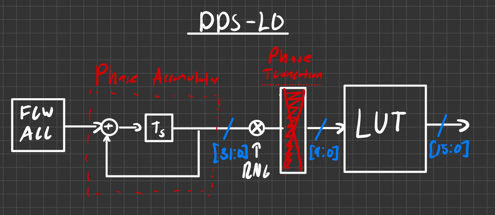

# RF-DDS-LO

## Overview
The goal of this project is to create a Direct Digital Synthesizer (DDS) that functions as a Local Oscillator (LO) for RF and DSP applications. The DDS-LO is a fundamental part of most DSP systems and this project is the is the first step of my overarching project inolving analyzing LoRa data from the Notre Dame IrishSAT IRIS project using the ULX3S fpga. The DDS-LO is essential to part of the de-chirping operation when decoding LoRA messages.

## System


## Hardware Requirements 

### FPGA Platform:  
[Radiona ULX3S](https://radiona.org/ulx3s/) (Lattice ECP5 LFE5U-85F)

## Decoding Specifications:  
Assuming a standard US 915 MHz LoRa signal, the ULX3S 25MHz clock, and a sweep durations of 1ms:

Signal Bandwith: 125 kHz

Accumulator bit-width: 32 bits

Frequency Step Resolution: 5 Hz 

Digital Chirp Rate Constant: 859

Target Output Signal: 125kHz Down-Chirp

## Software Environment and Requirements

### Operating System:   
This project was developed in an Arch Linux environment using open-source hardware toolchain dependencies. 

### Dependencies:  
* iverilog  
* gtkwave  
* yosys 
* nextpnr-ecp5  
* fujprog
* python3
* numpy

## Quick Start:

An automated shell script 'run_sim.sh' is provided in the root directory to execute the entire simulation pipeline from scratch. To run the full system simulation, make the script executable and execute it;

```bash
chmod +x run_sim.sh
./run_sim.sh
```

The script automatically executes the following pipeline stage:  

1. Invokes (scripts/gen_sin_table.py)[scripts/gen_sin_table.py] to calculate and format the 18-bit signed sine wave values into a (sine_table.mem)[sine_table.mem].
2. Compiles the top-level test bench along with all RTL source files using Icarus Verilog and runs the compiled binary via vvp. 
3. Launches GTKWave to view generated signal.

This repository includes a .lpf file for hardware integration of the ULX3S FPGA board.

## Reference:  
[Direct Digital Synthesizer](https://wirelesspi.com/direct-digital-synthesizer-dds/)
